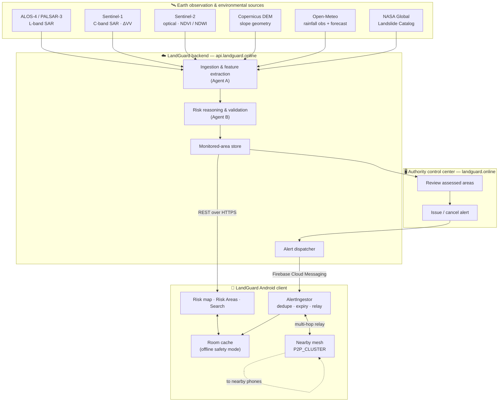
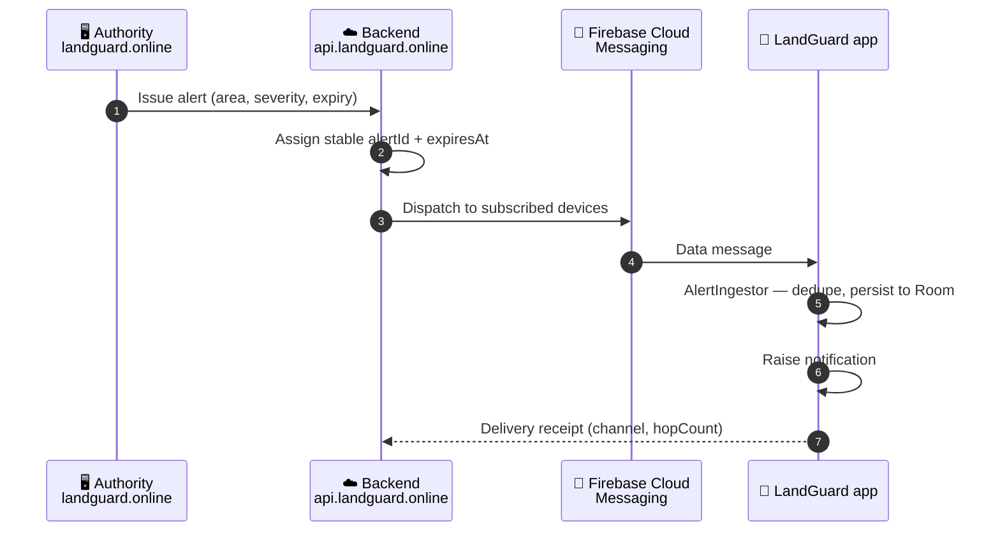
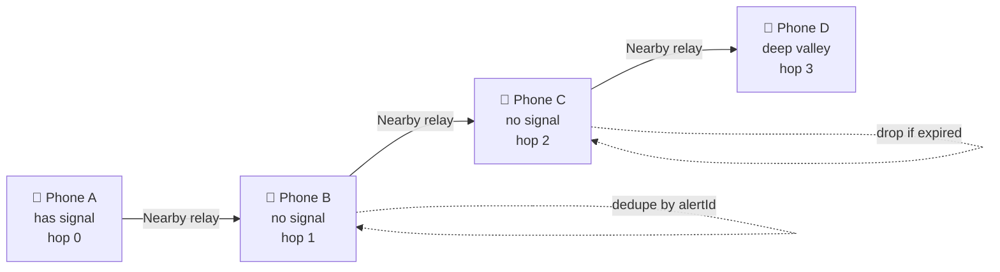

<div align="center">

# 🏔️ LandGuard

### AI-Powered Landslide Risk Monitoring & Early Warning System

**Satellite-derived terrain intelligence, delivered to the people standing on the slope — online or off.**

<br/>

[](https://github.com/SaikatxAlpha/LandGuard-app/releases/latest)
[](https://www.landguard.online/)
[](https://api.landguard.online/)

<br/>


-informational)


</div>

---

## Mission

Landslides kill because the warning arrives late, or never arrives at all — the valleys
most at risk are exactly the ones where the cell tower goes down first.

LandGuard closes both gaps. It fuses **SAR interferometry, optical vegetation indices,
terrain models, live rainfall and the historical landslide record** into a transparent,
per-area risk index, and it pushes authority-issued warnings to phones over two
independent channels: **Firebase Cloud Messaging when the network is up, and a
device-to-device Nearby Connections mesh when it is not.** An alert that reaches one
phone in a valley keeps hopping until it has reached them all.

---

## Highlights

|  | Capability | What it actually does |
|:--:|---|---|
| 🛰️ | **Real satellite pipeline** | ALOS-4/PALSAR-3 and Sentinel-1 SAR, Sentinel-2 optical, Copernicus DEM slope, Open-Meteo rainfall, NASA Global Landslide Catalog |
| 🧮 | **Transparent risk index** | Documented weighted heuristic over real inputs only — never a black box, and it reports its own data coverage |
| 📍 | **Location-aware monitoring** | Your GPS fix resolves the monitored areas around you and orders them by proximity |
| 🔔 | **Two-channel alerting** | Authority dashboard → backend → FCM push → Android notification, with delivery receipts |
| 📡 | **Offline multi-hop mesh** | Nearby Connections `P2P_CLUSTER` relay — alerts survive a total network blackout |
| 🗺️ | **Vector risk map** | MapLibre Native with risk-graded overlays, no proprietary map SDK |
| 🔍 | **Place search** | Geocoded search jumps the map to any place and surfaces the monitored areas near it |
| 💾 | **Cached safety mode** | Room-backed local store — the last known risk picture and every active alert stay readable offline |

---

## Screenshots

Every screen listed below is a real, shipping screen in the release build.

| Explore | Risk Areas | Area details |
|:--:|:--:|:--:|
| Live map centred on your location, with the monitored areas around you | Every monitored area, ranked by risk index and distance | Per-area breakdown: slope, rainfall, NDVI trend, SAR change, record |

| Alerts | Offline mode | Search |
|:--:|:--:|:--:|
| Authority-issued warnings, filterable by Critical / High / Moderate | Cached risk picture plus mesh-relayed alerts with no network | Geocoded place search that re-centres the map |

<!-- ══════════════════════════════════════════════════════════════════════
     SCREENSHOT GALLERY
     Add the PNG files listed in docs/screenshots/README.md, then delete
     this comment marker and its closing marker to publish the gallery.

| Explore | Risk Areas | Area details |
|:--:|:--:|:--:|
|  |  |  |

| Alerts | Offline mode | Search |
|:--:|:--:|:--:|
|  |  |  |

| Full map | Alert detail | More |
|:--:|:--:|:--:|
|  |  |  |

### Authority dashboard


     ══════════════════════════════════════════════════════════════════════ -->

📂 Capture instructions and required filenames: [`docs/screenshots/README.md`](docs/screenshots/README.md)

---

## Download

<div align="center">

### [⬇️ Download Latest APK](https://github.com/SaikatxAlpha/LandGuard-app/releases/latest)

</div>

LandGuard is distributed as a **signed release APK through GitHub Releases**.
**Google Play publication is pending** — until the listing is live, GitHub Releases is
the official distribution channel for this project.

Because the APK does not come from the Play Store, Android will ask you to permit
installation from your browser or file manager the first time. This is expected for
sideloaded builds.

| | |
|---|---|
| **Artifact** | `landguard-1.2-release.apk` |
| **Application ID** | `com.example.landguard` |
| **Version** | 1.2 (versionCode 3) |
| **Signing** | v2 + v3 APK Signature Scheme, RSA 4096 release key |
| **Requires** | Android 7.0 Nougat (API 24) or newer |
| **Backend** | `https://api.landguard.online/` — pre-configured, nothing to enter |

> **Verify what you install.** Compare the signing certificate of your download against
> the fingerprint published on the release page:
> ```bash
> apksigner verify --print-certs landguard-1.2-release.apk
> ```

---

## System architecture



### Repository scope

This repository is the **Android client**. The ingestion agents, the risk service and the
authority web console are deployed behind `api.landguard.online` and `landguard.online`
and are not part of this source tree. Everything documented under *Risk assessment* below
is implemented **in this repository** and can be read in the files cited.

---

## Real data pipeline

LandGuard consumes live, publicly attributable Earth-observation and environmental data.
Nothing in the risk index is synthesised.

| Input | Source | Used for |
|---|---|---|
| **L-band SAR** | ALOS-4 / PALSAR-3 | Ground displacement and structural change over vegetated terrain |
| **C-band SAR** | Sentinel-1 (via Microsoft Planetary Computer) | Backscatter change magnitude (ΔVV) as a surface-disturbance proxy |
| **Optical multispectral** | Sentinel-2 | NDVI vegetation stress, NDWI soil saturation |
| **Terrain model** | Copernicus DEM / SRTM | Slope angle — the dominant static susceptibility term |
| **Rainfall** | Open-Meteo | 72 h observed accumulation + 24 h forecast, the primary trigger signal |
| **Historical events** | NASA Global Landslide Catalog | Recorded landslides, clustered into monitored areas |
| **Basemap** | OpenFreeMap Liberty vector tiles | MapLibre rendering |

Monitored areas are formed by **greedy spatial clustering of recorded landslide events at a
15 km radius** — see [`RegionalAnalytics.kt`](app/src/main/java/com/example/landguard/data/regional/RegionalAnalytics.kt).

---

## Risk assessment

### Regional risk index — transparent by design

The index is a **documented heuristic over real inputs only**. Weights are renormalised
over the inputs actually available for an area, and the share of weight backed by real
data is surfaced in the UI as **coverage** — so a thin-data area never masquerades as a
confident one.

| Term | Normalisation | Source |
|---|---|---|
| Slope | 0 at ≤ 10°, 1 at ≥ 35° | Copernicus DEM |
| Rainfall | (72 h observed + 24 h forecast) ÷ 150 mm, capped | Open-Meteo |
| Record | recorded landslides nearby | NASA GLC |
| Vegetation | NDVI drop vs. one year earlier; −0.15 → 1 | Sentinel-2 |
| SAR | ΔVV magnitude from 0.5 dB → 3 dB mapped to 0…1 | Sentinel-1 |

📄 [`RegionalAnalytics.kt`](app/src/main/java/com/example/landguard/data/regional/RegionalAnalytics.kt)

### Parcel-level composite score

For an individual monitored parcel the on-device engine produces a 0–100 composite:

| Factor | Weight |
|---|:--:|
| InSAR ground displacement | **0.40** |
| Soil saturation (NDWI) | **0.25** |
| Terrain slope geometry | **0.20** |
| Vegetation stress (NDVI) | **0.15** |

Severity bands: **Critical ≥ 75 · High ≥ 50 · Moderate ≥ 25 · Low < 25**

📄 [`RiskEngineService.kt`](app/src/main/java/com/example/landguard/domain/service/RiskEngineService.kt)

---

## Alert delivery

### Online path — authority to handset



### Offline path — multi-hop device mesh

When the network is gone, LandGuard keeps moving alerts phone to phone over **Google
Nearby Connections** in `P2P_CLUSTER` strategy. Every relay increments `hopCount`; the
`alertId` is **never regenerated**, so an alert that arrives over both FCM and the mesh is
stored, shown and relayed **exactly once**.



Relay stops when the alert is **cancelled**, **expired**, or no longer relayable — expiry is
carried in the alert itself, so a stale warning cannot circulate indefinitely.

📄 [`AlertIngestor.kt`](app/src/main/java/com/example/landguard/data/alerts/AlertIngestor.kt) ·
[`NearbyMeshManager.kt`](app/src/main/java/com/example/landguard/offline/NearbyMeshManager.kt) ·
[`AlertContract.kt`](app/src/main/java/com/example/landguard/data/alerts/AlertContract.kt)

---

## Online / offline architecture

LandGuard is **offline-capable by construction**, not by fallback.

| | **Online** | **Offline** |
|---|---|---|
| Risk areas | Live from `api.landguard.online` | Last synced state from Room |
| Risk map | Vector tiles + live overlays | Cached overlays, cached tiles |
| New alerts | FCM push | Nearby Connections mesh relay |
| Alert history | Synced, receipts sent | Fully readable, receipts queued |
| Data freshness | — | Every surface carries an explicit staleness indicator |

The `DataStatus` indicator is shown on data-bearing screens and distinguishes
**live · refreshing · cached · unavailable**, so a user is never misled about how old the
risk picture in front of them is.

📄 [`DataStatus.kt`](app/src/main/java/com/example/landguard/ui/risk/DataStatus.kt) ·
[`NetworkMonitor.kt`](app/src/main/java/com/example/landguard/data/network/NetworkMonitor.kt)

---

## Technology stack

| Layer | Technology |
|---|---|
| **Language** | Kotlin, Coroutines + Flow |
| **UI** | Jetpack Compose, Material 3, Navigation Compose |
| **Architecture** | MVVM, unidirectional state, repository pattern |
| **DI** | Hilt (Dagger) with KSP |
| **Persistence** | Room |
| **Networking** | Retrofit 2.11 · OkHttp · Gson |
| **Mapping** | MapLibre Native Android 11.5.1 (fully open-source) |
| **Push** | Firebase Cloud Messaging (BoM 33.1.2) |
| **Offline transport** | Google Play Services Nearby 19.3.0 |
| **Build** | Gradle KTS, AGP, version catalogs, `compileSdk 35` |

---

## Installation

### From a release (recommended)

1. Open **[Releases → Latest](https://github.com/SaikatxAlpha/LandGuard-app/releases/latest)**
2. Download `landguard-1.2-release.apk`
3. Allow installation from your browser / file manager when prompted
4. Launch **LandGuard** — grant location and notification access when asked

There is **nothing to configure**. The production backend is compiled into the build; the
app never asks for a server address.

### From source

**Prerequisites** — JDK 17, Android SDK with `compileSdk 35`, Android Studio Ladybug or newer.

```bash
git clone https://github.com/SaikatxAlpha/LandGuard-app.git
cd LandGuard-app
```

Debug build:

```bash
./gradlew :app:assembleDebug
```

Signed release build — first create your own signing key and configuration:

```bash
keytool -genkeypair -v -keystore keystore/landguard-release.jks -alias landguard-release -keyalg RSA -keysize 4096 -validity 10950
cp keystore.properties.example keystore.properties
```

Fill in your values in `keystore.properties`, then:

```bash
./gradlew :app:assembleRelease
```

The APK lands at `app/build/outputs/apk/release/landguard-<versionName>-release.apk`.

> `keystore/`, `keystore.properties` and all `*.jks` / `*.keystore` files are git-ignored.
> **Never commit signing material.** In CI, supply `LANDGUARD_STORE_FILE`,
> `LANDGUARD_STORE_PASSWORD`, `LANDGUARD_KEY_ALIAS` and `LANDGUARD_KEY_PASSWORD` as
> encrypted secrets instead of a file. If no signing material is found the release build
> falls back to the debug key and prints a warning — such an APK is **not distributable**.

Run the test suite:

```bash
./gradlew :app:testDebugUnitTest
```

---

## Permissions

Every permission below is requested for a specific, user-visible capability.

| Permission | Why LandGuard needs it |
|---|---|
| `INTERNET`, `ACCESS_NETWORK_STATE` | Reach the backend; detect connectivity to switch into offline mode |
| `ACCESS_FINE_LOCATION`, `ACCESS_COARSE_LOCATION` | Resolve the monitored areas around you and order them by distance |
| `POST_NOTIFICATIONS` | Deliver landslide warnings (Android 13+) |
| `BLUETOOTH`, `BLUETOOTH_ADMIN` | Offline mesh transport on Android 11 and below |
| `BLUETOOTH_ADVERTISE`, `BLUETOOTH_CONNECT`, `BLUETOOTH_SCAN` | Offline mesh transport on Android 12+ |
| `ACCESS_WIFI_STATE`, `CHANGE_WIFI_STATE`, `NEARBY_WIFI_DEVICES` | Wi-Fi Direct leg of the Nearby Connections mesh |
| `WAKE_LOCK`, `com.google.android.c2dm.permission.RECEIVE` | Firebase Cloud Messaging delivery (merged in by the FCM SDK) |

**Network security.** Release builds set `usesCleartextTraffic=false` — all traffic is
HTTPS-only. HTTP body logging is compiled out of release builds so tokens and device
identifiers are never written to logcat.

---

## Project status

| Area | Status |
|---|:--:|
| Risk map, Risk Areas, area details | ✅ Shipped |
| Place search & location-based monitoring | ✅ Shipped |
| FCM alert delivery + notifications | ✅ Shipped |
| Offline Nearby multi-hop mesh relay | ✅ Shipped |
| Room offline cache & staleness indicators | ✅ Shipped |
| Signed release distribution | ✅ GitHub Releases |
| Google Play listing | ⏳ Pending |
| Play App Signing / R8 shrinking | ⏳ Planned |

Active development happens on feature branches; `main` carries the released state.

---

## Research & SIH context

LandGuard was built as a **Smart India Hackathon / applied-research prototype** addressing
landslide early warning in terrain where connectivity is the first casualty of the disaster
being warned about.

Its research contributions are deliberately narrow and defensible:

- **Multi-source fusion** of L-band SAR, C-band SAR, optical indices, terrain and rainfall
  into a single per-area index
- **Transparent, auditable scoring** — published weights and normalisation rather than an
  unexplainable model, with **explicit data-coverage reporting** so confidence degrades
  visibly when inputs are missing
- **Connectivity-resilient dissemination** — a store-and-forward device mesh that measurably
  extends warning reach beyond cellular coverage
- **Authority-in-the-loop** — automated assessment informs, but a human authority issues
  every alert

---

## Data & source disclaimer

> **LandGuard is a decision-support prototype, not a certified early-warning authority.**

- Risk scores are produced by a documented **heuristic model over open data**. They are
  indicative and are **not** a substitute for official geological survey assessment,
  statutory warnings, or evacuation orders issued by competent authorities.
- Satellite, rainfall and catalog data are supplied by third parties (ESA/Copernicus, JAXA,
  NASA, Open-Meteo, Microsoft Planetary Computer) under their own licences, revisit cadences
  and accuracy limits. Availability and latency are outside this project's control.
- The offline mesh is **best-effort**. Relay depends on device proximity, permissions,
  battery and radio state, and must never be treated as a guaranteed delivery channel.
- Historical landslide records are incomplete by nature; the absence of recorded events in
  an area does **not** imply the area is safe.
- **In an emergency, follow instructions from your local disaster management authority.**

All third-party data remains the property of its respective providers and is used in
accordance with their terms.

---

## License

Released under the **MIT License** — see [`LICENSE`](LICENSE).

Third-party data and services are governed by their own terms; see the disclaimer above.

---

<div align="center">

**LandGuard** · AI-Powered Landslide Risk Monitoring & Early Warning System

[Download APK](https://github.com/SaikatxAlpha/LandGuard-app/releases/latest) ·
[Authority Dashboard](https://www.landguard.online/) ·
[API](https://api.landguard.online/) ·
[Report an issue](https://github.com/SaikatxAlpha/LandGuard-app/issues)

</div>
